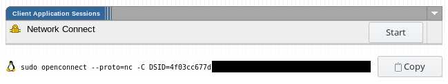

<!-- -*- mode: markdown; -*- -->
# Pulse-openconnect-helper

Browser script for connecting to Juniper Pulse Connect Secure VPN
using openconnect. Works even with the most hostile
two-factor-authentication schemes.

## How it works?

It's a user script installed to browser which steals the session cookie and shows the user a oneliner with the session cookie and other parameters for openconnect.

## Installation

1. Install [Greasemonkey](https://addons.mozilla.org/fi/firefox/addon/greasemonkey/) for Firefox or [Tampermonkey](https://chrome.google.com/webstore/detail/tampermonkey/dhdgffkkebhmkfjojejmpbldmpobfkfo) for Chrome/Chromium.
2. Open [pulse-openconnect.user.js](pulse-openconnect.user.js)

## Usage

Remember to use a browser which has the script installed.

1. Login to the VPN provider page using your browser as usual
2. Press *Copy* on the Openconnect line
3. Paste to terminal.

## License

[LICENSE](MIT License)
